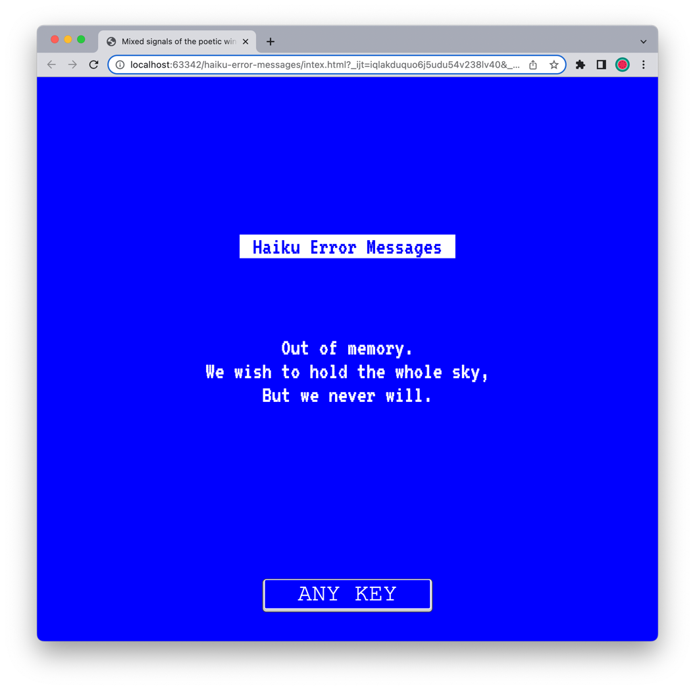

# Haiku Error Messages website
### Mixed Messages project: Haiku Error Messages

## About The Project

In the distant 1998 a Salon - a webresources dedicated to discussions on the topics of computer systems, has hosted a Challenge 4, in which the readers were encouraged to send in their attempts to make haikus on the topic of computer errors, preferably within the larger context of emotional impact of the momentary technological failure.

The results of the challenge turned out to be great success and were regularily republished by different outlets for many years after.

Now after 25 years, with the major technological convergence, most of the issues have become all but distant memory of the systems past. enge on the site Salon (now defunct), where the readers were invited to write a haiku on the topic of imagined computer failure, often within the context of the personal suffering due to technical failure. The challenge turned out to be a great sucess and the haikus were republished by many other websites for many years. However, after 25 years these morcels of humour are all but a distant memory of the much simpler computer systems.

## Table of contents

- [Overview](#overview)
    - [Screenshot](#screenshot)
    - [Links](#links)
- [My process](#my-process)
    - [Built with](#built-with)
    - [What I learned](#what-i-learned)
    - [Continued development](#continued-development)
    - [Useful resources](#useful-resources)
- [Author](#author)

## Overview

A nostalgic, non-antialiasted reminder of the Blue Screen of Death of the times of Windows NT as a solution for an open assignment in the [Codecademy](https://codecademy.com)'s Full-Stack Developer stream.

### Screenshot
 

### Links

- The original publication on [Webarchive](https://web.archive.org/web/20050301085638/http://archive.salon.com/21st/chal/1998/02/10chal2.html)
- A selection of some hakus on [GNU Operating System](https://www.gnu.org/fun/jokes/error-haiku.en.html)

### Built with

- Semantic HTML5 markup
- CSS custom properties
- Flexbox
- JavaScript

## Author

evilcloud
