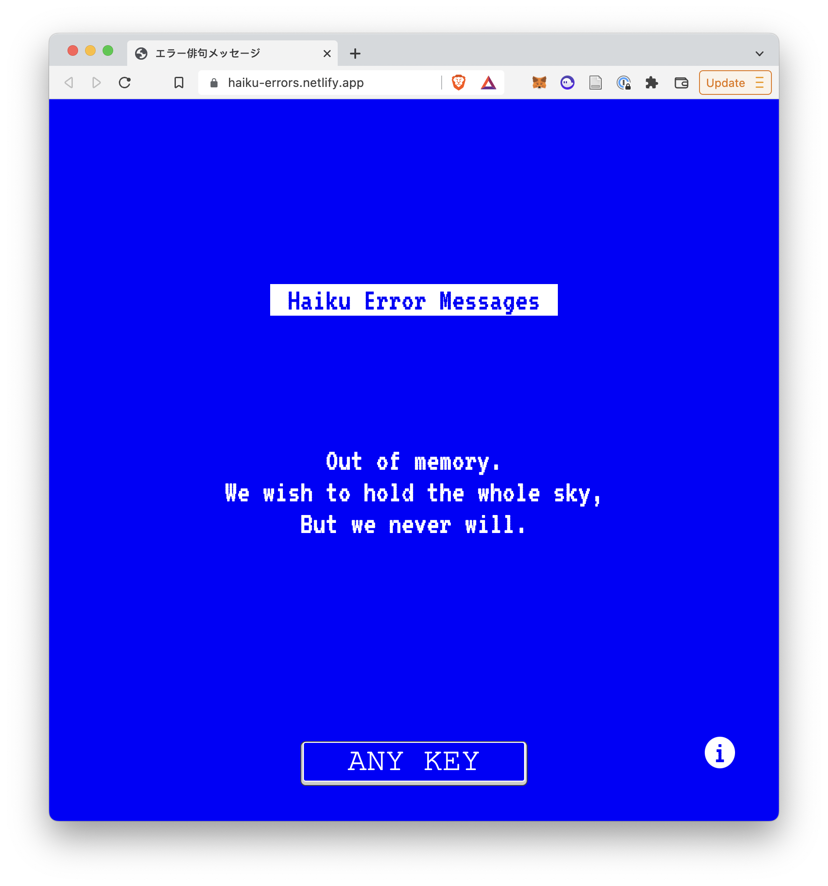

# Haiku Error Messages (web)

## What is this about?
In the distant 1998 *Salon 21st* - a website of the Salon Magazine, dedicated to discussions on the topics of cultural and technological convergences, has hosted a challenge, in which the readers were tasked compose a haiku of 21st century, based around error messages given out by (questionably) empathic computer systems. The humour lies within the larger context of emotional impact of the momentary technological failure.

Almost immediately the magazine was forced to deal with the backlash from the internet community, as most haikus were plagiarised from a relatively infamous email chain list. Salon has published a non-apology explanation, trying to minimise the damage in a typical terrible way any media outlet of those times would do. The challenge website was taken down and now can be found only in the webarchives. Despite all this, the publication has helped to popularise the haikus and they have been regularly republished by different outlets for many years after.

Now after 25 years, with the major technological advancements and consumerist-centric technological development, most of the issues discussed in haikus have become all but distant memory of the systems past. The purpose of these morsel of romanticist humour has shifted to nostalgic non-antialiased remains of the distant memories of the Blue Screen of Death back when Windows NT was considered a legitimate server platform. 

## Table of contents

- [What is this about?](#What-is-this-about)
- [About this project](#overview)
- [Screenshot](#screenshot)
- [Links](#links)
- [Built with](#built-with)

## About this project

The primary purpose of this project is the solution for an open assignment in the [Codecademy](https://codecademy.com)'s Full-Stack Developer stream.

### Screenshot
 

### Links

- [Live site](https://haiku-errors.netlify.app/)
- The original publication Salon 21st [Webarchive](https://web.archive.org/web/20050301085638/http://archive.salon.com/21st/chal/1998/02/10chal2.html)
- Salon’s bullshit explanation of how none of this is their [fault](https://www.salon.com/1998/02/24/straight_14/)
- A selection of some hakus on [GNU Operating System](https://www.gnu.org/fun/jokes/error-haiku.en.html)
- Real haiku by the undeniable pioneer of the genre [hardcover](https://www.amazon.com/Basho-Complete-Haiku-Matsuo/dp/1568365373)

### Built with

- Semantic HTML5 markup
- CSS custom properties
- Flexbox
- JavaScript

